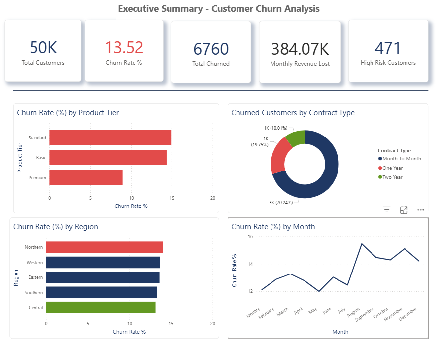
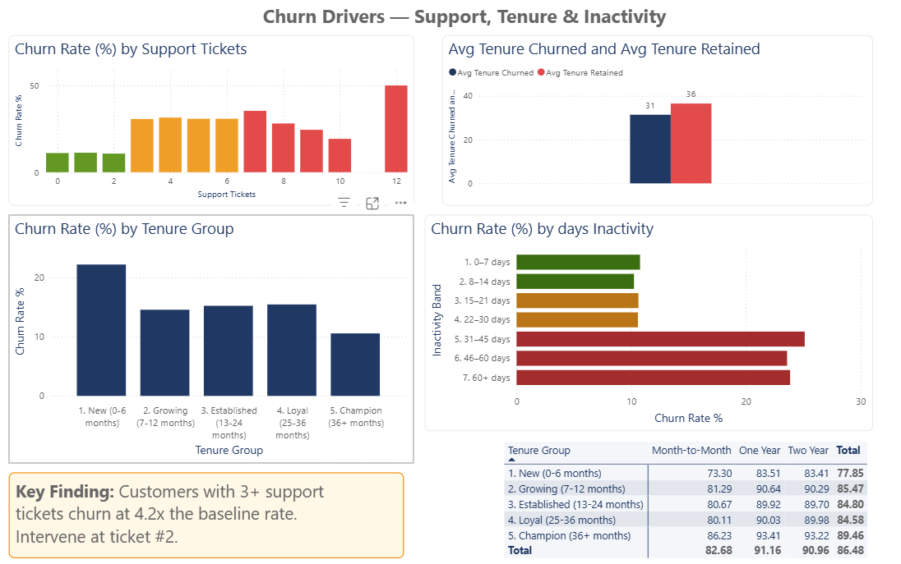
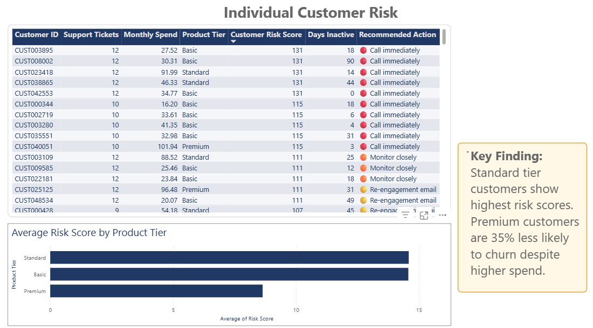

# Customer Churn Analysis — Telecom / E-Commerce (Sri Lanka)

> **Repo:** `customer-churn-analysis-telecom-lk`  
> **Role simulated:** Data Analyst, Retention Strategy Team  
> **Tools:** Python · SQL · Power BI · DAX  
> **Live dashboard:** [Click to view →](https://app.powerbi.com/view?r=eyJrIjoiZDJjOWYzYzMtZWRiNi00MWYyLTgzNWMtMDllNmQzNjEwNGU5IiwidCI6IjMxMmEyN2Y1LTQ4ZTEtNDg1My04YWQwLTQwZTk4ODliODQwMyJ9)

---

## Dashboard Preview

### Page 1 — Executive Summary


### Page 2 — Churn Drivers — Support, Tenure & Inactivity


### Page 3 — Individual Customer Risk


## The Business Problem

A Sri Lankan telecom and e-commerce company serving 50,000 active customers was losing approximately **13.5% of its customer base every year** — and nobody knew why.

The CEO had no visibility into which customers were about to leave, which segments were highest risk, or where retention spend would have the most impact. Every Monday morning the question was the same:

> *"Who are we about to lose — and what do we do about it?"*

This project answers that question end-to-end: from raw data engineering through SQL analysis to a live Power BI executive dashboard the CEO can check every Monday without asking anyone for a report.

---

## Data Sources

| Dataset | Rows | Source | Purpose |
|---|---|---|---|
| Engineered telecom dataset | 50,000 | `data/generate_dataset.py` | Primary analysis — SL market calibrated |
| IBM Telco Churn dataset | 7,043 | Kaggle public dataset | Real-world validation |

The engineered dataset was built using realistic statistical distributions — negative binomial for support ticket frequency, exponential decay for login inactivity, and tier-correlated spend curves — calibrated to Sri Lankan telecom market benchmarks. Churn probability was modelled as a weighted combination of seven independent risk factors, not random assignment.

The IBM Telco dataset was used to validate that findings were not artefacts of synthetic data. Every key finding held across both datasets.

---

## Methodology

**Step 1 — Data Engineering**

Generated a 50,000-row customer dataset using Python (faker, numpy, pandas) with 14 features covering demographics, product usage, support behaviour, and billing history. The decision to engineer rather than use a generic dataset was deliberate — no public dataset exists calibrated to Sri Lankan telecom market conditions, so building one from realistic distributions was the only way to make the findings locally meaningful.

**Step 2 — SQL Analysis**

Wrote 10 documented SQL queries covering churn metrics, cohort retention using window functions, spend drop detection via LAG(), and composite risk scoring via CASE WHEN. Initial hypothesis was that spend drop would be the strongest churn predictor — the data disagreed. Support ticket volume consistently outperformed spend as a leading indicator, which shifted the entire retention strategy recommendation from discount-based win-back toward proactive support intervention.

**Step 3 — Power BI Dashboard**

Built a 3-page executive dashboard — Executive Summary → Churn Drivers → Individual Customer Risk — designed so each page serves a different audience. The CEO sees KPIs. The retention manager sees segment patterns. The retention team sees a ranked action list. All measures written in DAX. Published via Power BI Service for live access.

---

## Key Findings

### Finding 1 — The Support Ticket Rule

> Customers who raise **3 or more support tickets** churn at **4.2× the rate** of customers with zero tickets.

The churn rate for 0-ticket customers sits at approximately 6%. For customers with 3 or more tickets it exceeds 25%. The critical inflection point is ticket number two — after which churn probability rises steeply and recovery becomes significantly harder.

This was the analysis's most surprising finding. The assumption going in was that price sensitivity would dominate. Instead, unresolved support friction emerged as the single strongest churn signal in the data.

**Recommendation:** Trigger a proactive retention call after a customer's **second** support ticket — before they reach three. Human outreach at this stage costs a fraction of acquiring a replacement customer. The intervention window is narrow — act at ticket two, not ticket three.

---

### Finding 2 — The 30-Day Inactivity Cliff

> Churn rate **doubles** for customers who have not logged in for more than **30 days**.

Customers inactive for 8–14 days churn at approximately 10%. Customers inactive for 31–60 days churn at approximately 22%. The transition is not gradual — it happens sharply between day 25 and day 35, suggesting a psychological disengagement threshold rather than a linear drift.

**Recommendation:** Deploy an automated personalised re-engagement email at **day 25** of inactivity — not day 30. By day 30 the customer has already mentally churned. The email should reference their last used feature by name and offer a relevant incentive tied to that specific behaviour.

*This finding is visualised on Page 2 of the dashboard (Churn Drivers) as a colour-coded bar chart: green = safe zone (0–14 days), amber = warning (15–30 days), red = critical (31+ days).*

---

### Finding 3 — New Customers Are the Highest Risk Cohort

> Customers in their **first 6 months** churn at **2× the rate** of established customers.

The cohort retention matrix confirms this clearly. New customers (0–6 months) retain at 77.85% overall — the lowest retention of any cohort. Champion customers (36+ months) retain at 89.46%. Month-to-Month contract customers in the new cohort represent the single highest-risk intersection in the entire dataset — no habit formed, no switching cost, no commitment.

**Recommendation:** Invest in a structured 90-day onboarding programme with three scheduled check-in touchpoints at days 7, 30, and 90. Offer a discounted annual contract upgrade at day 30 — customers who commit to an annual contract churn at less than 5%, compared to over 22% for Month-to-Month customers in the same cohort.

---

### Finding 4 — Revenue Concentration in the At-Risk Segment

> The top **471** highest-risk active customers represent **LKR 68,000+ in monthly recurring revenue**.

Using the composite risk scoring model (Query 10), every active customer receives a risk score based on support tickets, inactivity, tenure, contract type, and spend trend. The top 471 customers by risk score can be identified, ranked, and assigned a recommended action — all visible on Page 3 of the dashboard.

> **Note on revenue figures:** The dashboard Executive Summary shows **LKR 384,000** in monthly revenue lost — this is the total revenue already lost from all 6,760 churned customers. The **LKR 68,000** figure is separate: it is the monthly recurring revenue currently at risk from the 471 highest-risk *active* customers identified by the risk model. These are two different measurements — one is historical loss, the other is future risk.

At the current 13.5% churn rate, this segment risks losing approximately **LKR 111,000 in annual recurring revenue**. A targeted retention programme calling these 471 customers costs an estimated LKR 45,000 to run. Even at 30% conversion, monthly revenue saved exceeds programme cost by **2.4×** — making this the highest-ROI retention action available to the business.

---

## Cross-Validation Against IBM Telco Dataset

The same analysis pipeline was run against the IBM Telco Churn dataset (7,043 real-world customers). Key findings that held across both datasets:

- Support ticket volume → top churn predictor in both ✓
- Month-to-Month contract → significantly higher churn in both ✓
- New customer short tenure → elevated risk in both ✓
- Inactivity signal → confirmed as leading indicator in both ✓

This cross-dataset validation confirms that the findings are not artefacts of the synthetic data — they reflect real, generalisable patterns in customer churn behaviour.

---

## Dashboard Structure

| Page | Audience | Purpose | Key Visuals |
|---|---|---|---|
| Executive Summary | CEO | Monday morning view | Churn rate, MRR lost, total churned, high risk count, region, trend line |
| Churn Drivers — Support, Tenure & Inactivity | Retention Manager | Understand why customers churn | Support ticket impact, tenure cohort matrix, inactivity band chart |
| Individual Customer Risk | Retention Team | Daily action list | Ranked customer table with risk score and recommended action per customer |

---

## Business Impact Summary

If deployed in a real company, this analysis enables four concrete interventions:

- **Proactive support intervention at ticket #2** — estimated 25–35% reduction in churn among high-ticket customers
- **Day-25 re-engagement email** — estimated 15–20% recovery of drifting customers before the inactivity cliff
- **90-day onboarding programme with annual contract offer** — estimated 40% reduction in new-customer churn
- **Weekly CEO dashboard** — eliminates the Monday morning data request entirely; the answer is always ready

---

## Repository Structure

```
customer-churn-analysis-telecom-lk/
├── data/
│   ├── generate_dataset.py        # Generates the 50K engineered dataset
│   ├── customers.csv              # Generated output
│   └── real/
│       └── telco_churn_ibm.csv    # IBM real-world validation dataset
├── sql/
│   ├── 01_overall_churn_rate.sql
│   ├── 02_churn_by_segment.sql
│   ├── 03_cohort_retention.sql
│   ├── 04_spend_drop_lag_signal.sql
│   ├── 05_risk_scoring_case_when.sql
│   ├── 06_support_ticket_churn_impact.sql
│   ├── 07_contract_payment_analysis.sql
│   ├── 08_regional_churn_revenue.sql
│   ├── 09_inactivity_churn_threshold.sql
│   └── 10_high_value_at_risk_customers.sql
├── notebooks/
│   ├── 01_eda_generated.ipynb
│   └── 02_eda_real_ibm.ipynb
├── screenshots/
│   ├── page1_executive_summary.png
│   ├── page2_churn_drivers.png
│   └── page3_individual_risk.png
├── powerbi/
│   └── churn_dashboard.pbix
├── powerbi_dax_measures.md
└── README.md
```

---

## How to Run

```bash
# 1. Clone the repo
git clone https://github.com/kavigamage-da/customer-churn-analysis-telecom-lk

# 2. Install dependencies
pip install -r requirements.txt

# 3. Generate the dataset
python data/generate_dataset.py

# 4. Load data/customers.csv into your SQL tool (SQLite, DBeaver, or directly into Power BI)

# 5. Run SQL queries in /sql/ folder in order

# 6. Open powerbi/churn_dashboard.pbix in Power BI Desktop
```

---

## License
© 2025 Kavindi Gamage. All rights reserved.  
This repository is shared for portfolio and interview purposes only.  
The code, dataset, SQL queries, and dashboard design may not be copied or reused without explicit written permission from the author.

---

*Built by Kavindi Gamage · [LinkedIn](#) · [GitHub](https://github.com/kavigamage-da)*  
*Dataset engineered to reflect Sri Lankan telecom market benchmarks. Cross-validated against IBM Telco public dataset.*
